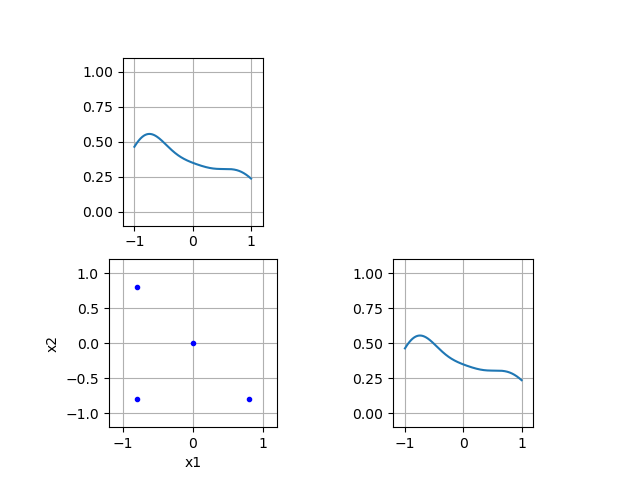
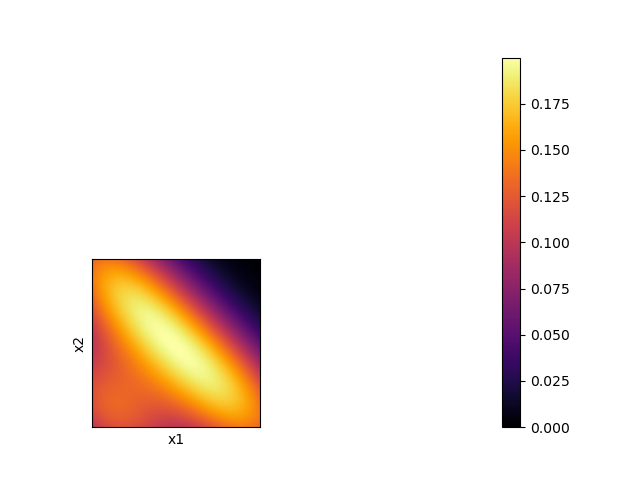
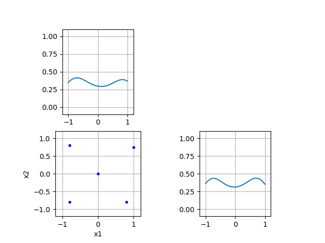
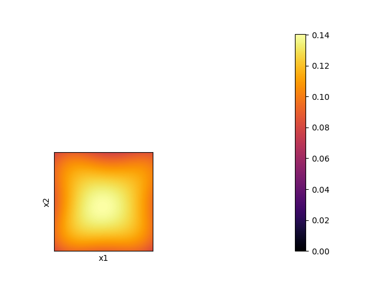
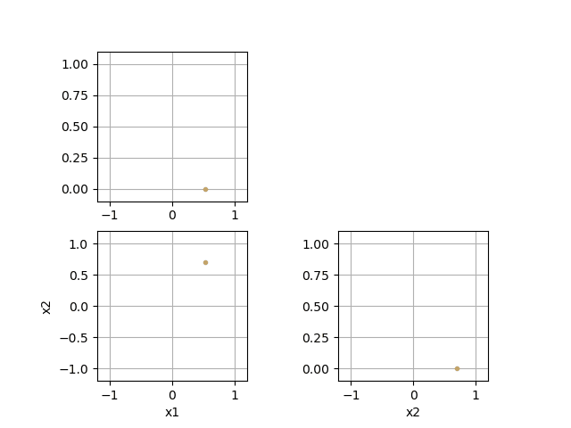
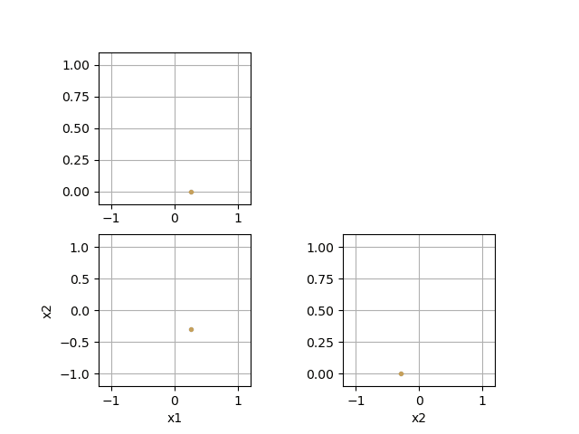

# DESSCA
**D**ensity **E**stimation-based **S**tate-**S**pace **C**overage **A**cceleration

The provided DESSCA algorithm was designed to aid the state space exploration in reinforcement learning applications.
In many cases where standard exploring starts may be used, 
the degree of freedom that is provided by the initial state can be utilized to a better extent when using DESSCA instead.
Suggestions or experiences concerning applications of DESSCA outside reinforcement learning are welcome!

## Citing
An in-depth explanation of the principle, realization and improvement capabilities of DESSCA can be found in the article 
"Improved Exploring Starts by Kernel Density Estimation-Based State-Space Coverage Acceleration in Reinforcement Learning".
Please cite it when using the provided code:

```
PLACEHOLDER FOR BIBTEX SOURCE
```

## Usage

This code snippet serves as a minimal usage example to DESSCA.
Firstly, import the dessca_model from DESSCA.py and create a corresponding object.
Make Sure to have DESSCA.py in the same folder as its application file

```
import numpy as np
from DESSCA import dessca_model
my_dessca_instance0 = dessca_model(box_constraints=[[-1, 1],
                                                    [-1, 1]],
                                   state_names=["x1", "x2"],
                                   bandwidth=0.5)
```

This model instance can be used on a two-dimensional state space.
Now let's make use of its functionality by viewing the state-space coverage of a dataset.
Here are some samples:

```
samples_2d = np.array([[-0.8, -0.8],
                       [0.8, -0.8],
                       [-0.8, 0.8],
                       [0, 0]])

my_dessca_instance0.update_coverage_pdf(data=np.transpose(samples_2d))
my_dessca_instance0.plot_scatter()
```

Output:



And a corresponding coverage heatmap


```
my_dessca_instance0.plot_heatmap()
```

Output:



The coverage pdf is updated with the given distribution.
DESSCA can now suggest where to place the next sample.

```
next_sample_suggest = my_dessca_instance0.sample_optimally()
print(next_sample_suggest)
```

Output:
[0.99377672 0.97026156] 
(Note: results are a little random in scenarios with very few samples)

As was to be expected, the suggestion is in the upper right corner of the state space.
Update the coverage density and view the new distribution:

```
my_dessca_instance0.update_coverage_pdf(data=np.transpose([next_sample_suggest]))
my_dessca_instance0.plot_scatter()
```

Output:



Let's have a look at the density:

```
my_dessca_instance0.plot_heatmap()
```

Output:



### More Features
The scatter plots can also be rendered in an online fashion (100 samples):
```
my_dessca_instance1 = dessca_model(box_constraints=[[-1, 1],
                                                    [-1, 1]],
                                  state_names=["x1", "x2"],
                                  bandwidth=0.1,
                                  render_online=True)

next_sample_suggest = my_dessca_instance1.update_and_sample()
for _ in range(100):
    next_sample_suggest = my_dessca_instance1.update_and_sample(np.transpose([next_sample_suggest]))
```

Output:


Further, we can parameterize a memory buffer to only memorize a limited number of past samples:

```
my_dessca_instance2 = dessca_model(box_constraints=[[-1, 1],
                                                    [-1, 1]],
                                  state_names=["x1", "x2"],
                                  bandwidth=0.1,
                                  render_online=True,
                                  buffer_size=25)

next_sample_suggest = my_dessca_instance2.update_and_sample()
for _ in range(100):
    next_sample_suggest = my_dessca_instance2.update_and_sample(np.transpose([next_sample_suggest]))
```

Output:



See how forgetting past samples leads to a group of samples in a similar area?
Lastly, we can also choose to use a specific reference coverage density:

```
def reference_coverage(X):
    # for uniform distribution on a given shape the value range of the reference coverage is not important
    x0 = X[0]
    x1 = X[1]
    return np.less(x0**2 + x1**2, 1).astype(float)

my_dessca_instance3 = dessca_model(box_constraints=[[-1, 1],
                                                    [-1, 1]],
                                  state_names=["x1", "x2"],
                                  bandwidth=0.1,
                                  render_online=True,
                                  reference_pdf=reference_coverage)

next_sample_suggest = my_dessca_instance3.update_and_sample()
for _ in range(100):
    next_sample_suggest = my_dessca_instance3.update_and_sample(np.transpose([next_sample_suggest]))
```

Output:


